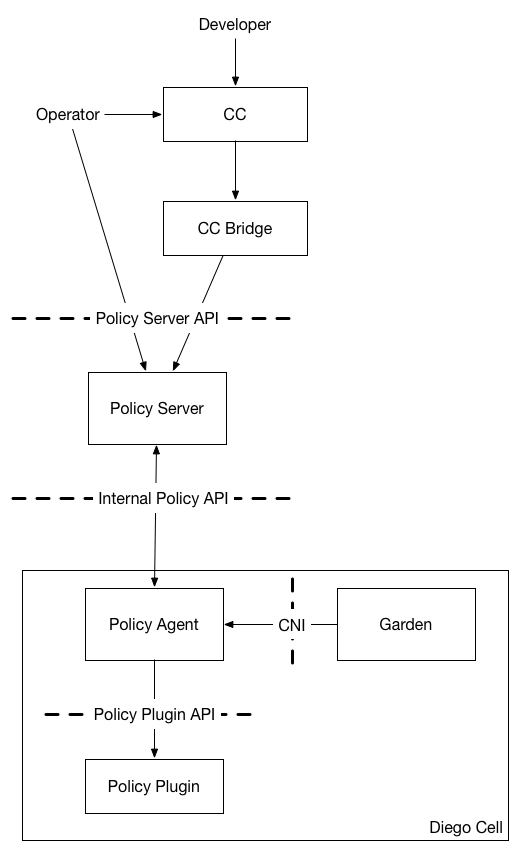

*very rough notes on how we might implement policy in an extensible way*


# Context

## Goals of the policy effort
- operators, developers, high-level components like cloud controller can declare policy as a set of edges in a graph where the nodes are applications, or other endpoints within a larger network (e.g. BOSH-deployed data services)
- this high-level policy can be realized on the wire, and in the network stack, in any number of ways (e.g. iptables, ethtables, open vswitch, iovisor, etc) depending on the needs of a particular CF installation.
- the core open-source components of cloud foundry can remain agnostic to those wire-level & stack-level details
- the core open-source policy components should be agnostic about mechanisms of connectivity (calico, vxlan, etc) and addressing (ipv4 vs ipv6; address reuse across virtual networks vs single global address space).  those details may be provided by CNI plugins in the connectivity behavior of the container networking system.

## about this document
- API specs are skeletal, not exhaustive.  they suggest a direction.
- nothing is for certain!


# APIs



## Policy Server API

- POST `/app`

  *as the CC bridge, I POST to this endpoint on the Policy Server to register a new app.*

  Request:
  ```
  { 
    "guid": "db8e8142-3d4e-413f-99ef-f2a9f644e1b1"
  }
  ```
  Response:
  ```
  { 
    "guid": "db8e8142-3d4e-413f-99ef-f2a9f644e1b1",
    "group_id": "a7e0cd35"
  }
  ```

- POST `/whitelist`

  *as an operator or automated component I POST to this endpoint on the Policy Server to allow traffic between two apps*

  Request:
  ```
  { 
    "source": "db8e8142-3d4e-413f-99ef-f2a9f644e1b1",
    "destination": "55c21794-95a8-41bc-b320-3f79540a6789"
  }
  ```
  
## Internal Policy API
- GET `/app/:app_guid`

  *as the policy agent running on a diego cell, when a new app with `:app_guid` is created on my cell,
    then I GET a group_id and a whitelist from this endpoint on the Policy Server, which I will pass on to the policy plugin running on my cell.  I do not need to understand the semantic meaning of the bytes on the wire*

  Response:
  ```
  {
    "group_id": "a7e0cd35",
    "allowed_group_id": [
      "a7e0cd35",
      "7578a0fa"
    ]
  }
  ```
- some TBD push mechanism as well?  so that Policy Server can inform agents about changes to the whitelist?
  
## Policy Plugin API

- POST `/configure`

  *as the policy agent running on a diego cell, when a new app with `:app_guid` is created on my cell,
    I POST to this endpoint on the policy plugin in order to tell it about a new ethernet device on the system.
    the policy plugin understands the meaning of these identifiers and how to enforce policy with them.*

  Request:
  ```
  {
     "destination_device": {
       "namespace": "/var/vcap/data/ducati/sandboxes/vni-42",
       "interface_name": "g-db8e81423d4e",
       "group_id": "a7e0cd35"
     },
     "allowed_group_id": {
       [
        "a7e0cd35",
        "7578a0fa"
       ]
     }
  }
  ```
